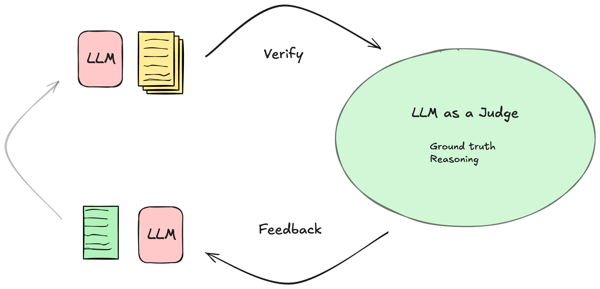

## Optimizing Enterprise Chatbots: How Crypto.com Leverages LLM Feedback and Critiques for Enhanced Efficiency

Modern chatbots in production face increasingly complex challenges. Beyond handling basic FAQs, they must now execute meaningful actions, adhere to company policies, implement content filtering, escalate to human operators when needed, and manage follow-up tasks. These requirements demand sophisticated systems capable of handling diverse scenarios while maintaining consistency and compliance.

To address these challenges, a modular subsystem architecture proves invaluable. This approach allows for flexible integration of different processing logics, such as intelligent routing between knowledge bases, dynamic prioritization of information sources, and seamless incorporation of business rules and policies. Each subsystem can be independently developed and optimized for specific tasks while maintaining overall system coherence.

As chatbot systems grow in complexity with multiple subsystems handling various workloads, the importance of prompt engineering becomes increasingly evident. Crafting effective prompts that work across different subsystems while maintaining consistency and accuracy is both critical and time-intensive. This challenge is particularly acute in enterprise environments where precision and reliability are paramount.

In this blog post, we'll explore how we've leveraged user and system feedback to continuously improve and optimize our instruction prompts. This feedback-driven approach has enabled us to create more effective prompts that adapt to various subsystems while maintaining high performance across different use cases.

## Feedback is important for improving the performance of LLM

While Large Language Models (LLMs) have demonstrated remarkable capabilities, they can sometimes struggle with complex or ambiguous inputs. This is where feedback mechanisms become essential. By incorporating feedback loops, LLMs can learn from their mistakes, refine the instruction, and adapt to challenging scenarios.

One powerful approach is critiquing, where LLMs are paired with external feedback mechanism that provide critiques or feedbacks. For instance, when processing documents, if an LLM generates an incorrect summary, a fact-checking tool can identify inaccuracies and provide feedback. The model can then revise its output, leading to improved accuracy and reliability. This iterative process mirrors human learning, where feedback drives continuous improvement.

The effectiveness of feedback mechanisms extends beyond simple error correction, enabling LLMs to develop a nuanced understanding of task requirements. Through iterative feedback cycles, models can learn to interpret ambiguous instructions more effectively, identify implicit context, and adapt their processing strategies accordingly. This capability is particularly valuable in enterprise settings where complex, domain-specific tasks require precise interpretation of instructions. By analyzing feedback patterns over time, LLMs can even anticipate potential misunderstandings and proactively adjust their approach, leading to more efficient and accurate outcomes.

 For deeper insights into these mechanisms, we recommend exploring two key research papers: [CRITIC](https://arxiv.org/abs/2305.11738), which demonstrates how LLMs can self-correct with tool-interactive critiquing, and [Reflexion](https://arxiv.org/abs/2303.11366), which explores language agents with verbal reinforcement learning. The figure below provides a visual representation of this feedback process.

In the next section, we'll explore how these feedback mechanisms can be operationalized to enhance workflows.

## Solution overview

## Conclusion

The integration of feedback mechanisms into chatbot systems represents a significant leap forward in conversational AI capabilities. By implementing robust feedback loops, we've demonstrated how chatbots can evolve from static question-answering systems to dynamic, self-improving platforms. The modular subsystem architecture, combined with continuous prompt optimization through feedback, enables chatbots to handle increasingly complex tasks while maintaining compliance and accuracy.

As we've shown through practical examples and research insights, feedback-driven systems not only improve output quality but also enhance the effectiveness of input instructions. This dual optimization creates a virtuous cycle of improvement, particularly valuable in enterprise environments where precision and adaptability are crucial.

Looking ahead, the continued refinement of feedback mechanisms and prompt engineering techniques will be essential for developing next-generation chatbot systems. By embracing these approaches, organizations can create AI assistants that not only meet current demands but also adapt to future challenges, delivering increasingly sophisticated and reliable interactions.

